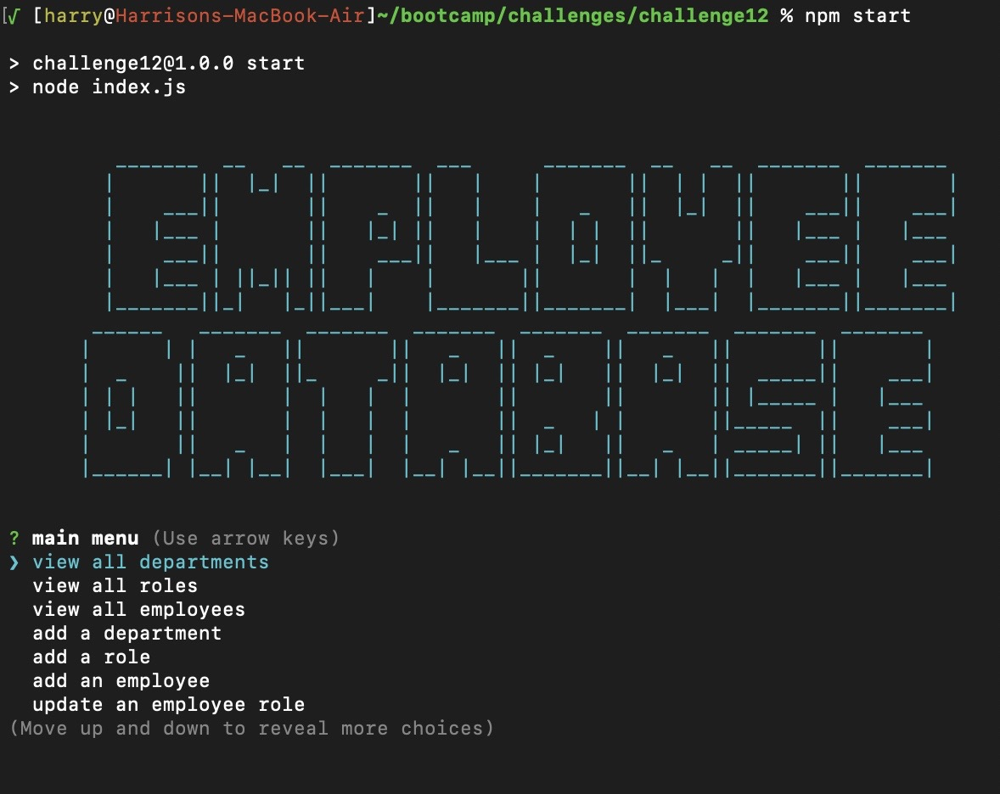
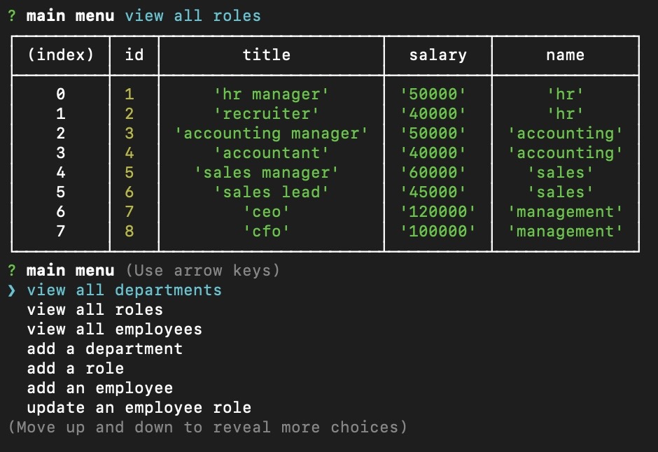
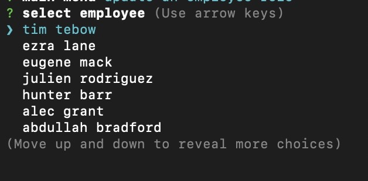

# Employee Tracker Database

## Description

This application allows the user to manage a database of employee information.

  ## Table of Contents
1. [Installation](#installation)
2. [Usage](#usage)
3. [Contributing](#contributing)
4. [Questions](#questions)
  

## Installation

To utilize this app, users will need to have mysql CLI interface, the mysql application, and node application installed. User's must source the included schema.sql database through the mysql interface, perform an install of node dependencies by running the cli command 'npm i' in the command line of the root folder. To run the application, the user must run the cli command 'npm start' or 'node index.js'.

## Usage

To demonstrate the usage, please consult this demonstration video: <a href="https://youtu.be/QmaMMxaw7Qo">https://youtu.be/QmaMMxaw7Qo</a>

Upon launch, the program launches the following title screen and menu: 

The application utilizes a number of display outputs: 

And dynamic menu outputs: 

## Contributing

<a href="https://github.com/harryhamlin">github.com/harryhamlin</a>

## Questions

For any questions, please reach out directly to <a href="mailto:harryhamlin@gmail.com" target="_blank">harryhamlin@gmail.com</a>.

